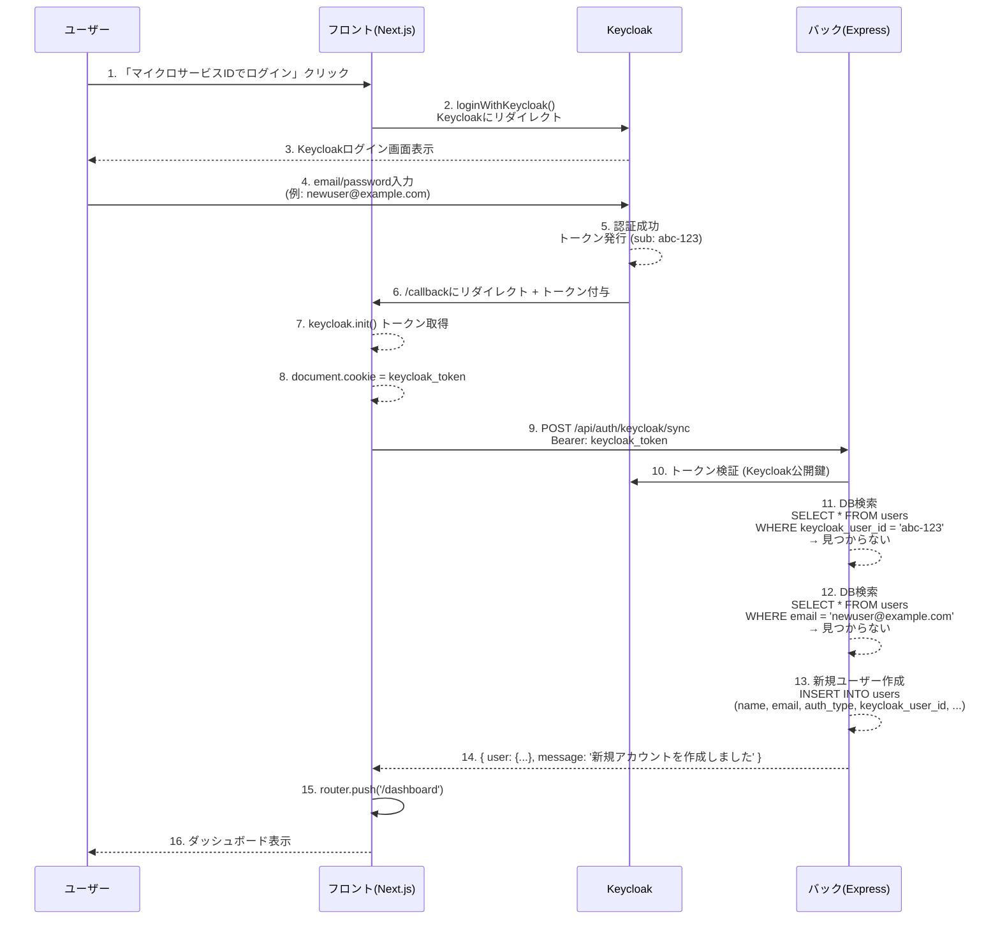

```mermaid
sequenceDiagram
    participant U as ユーザー
    participant F as フロント(Next.js)
    participant K as Keycloak
    participant B as バック(Express)

    U->>F: 1. 「マイクロサービスIDでログイン」クリック
    F->>K: 2. loginWithKeycloak() <br/>Keycloakにリダイレクト
    K-->>U: 3. Keycloakログイン画面表示
    U->>K: 4. email/password入力<br/>(例: newuser@example.com)
    K-->>K: 5. 認証成功<br/>トークン発行 (sub: abc-123)
    K->>F: 6. /callbackにリダイレクト + トークン付与
    F-->>F: 7. keycloak.init() トークン取得
    F-->>F: 8. document.cookie = keycloak_token
    F->>B: 9. POST /api/auth/keycloak/sync<br/>Bearer: keycloak_token
    B->>K: 10. トークン検証 (Keycloak公開鍵)
    B-->>B: 11. DB検索<br/>SELECT * FROM users<br/>WHERE keycloak_user_id = 'abc-123'<br/>→ 見つからない
    B-->>B: 12. DB検索<br/>SELECT * FROM users<br/>WHERE email = 'newuser@example.com'<br/>→ 見つからない
    B-->>B: 13. 新規ユーザー作成<br/>INSERT INTO users<br/>(name, email, auth_type, keycloak_user_id, ...)
    B-->>F: 14. { user: {...}, message: '新規アカウントを作成しました' }
    F->>F: 15. router.push('/dashboard')
    F-->>U: 16. ダッシュボード表示

```