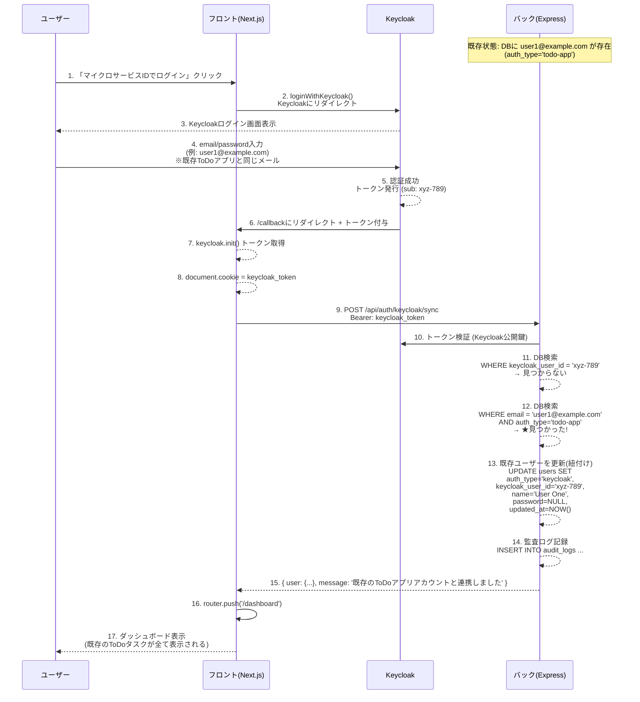

```mermaid
sequenceDiagram
    participant U as ユーザー
    participant F as フロント(Next.js)
    participant K as Keycloak
    participant B as バック(Express)

    Note over B: 既存状態: DBに user1@example.com が存在<br/>(auth_type='todo-app')

    U->>F: 1. 「マイクロサービスIDでログイン」クリック
    F->>K: 2. loginWithKeycloak()<br/>Keycloakにリダイレクト
    K-->>U: 3. Keycloakログイン画面表示
    U->>K: 4. email/password入力<br/>(例: user1@example.com)<br/>※既存ToDoアプリと同じメール
    K-->>K: 5. 認証成功<br/>トークン発行 (sub: xyz-789)
    K->>F: 6. /callbackにリダイレクト + トークン付与
    F-->>F: 7. keycloak.init() トークン取得
    F-->>F: 8. document.cookie = keycloak_token
    F->>B: 9. POST /api/auth/keycloak/sync<br/>Bearer: keycloak_token
    B->>K: 10. トークン検証 (Keycloak公開鍵)
    B-->>B: 11. DB検索<br/>WHERE keycloak_user_id = 'xyz-789'<br/>→ 見つからない
    B-->>B: 12. DB検索<br/>WHERE email = 'user1@example.com'<br/>AND auth_type='todo-app'<br/>→ ★見つかった!
    B-->>B: 13. 既存ユーザーを更新(紐付け)<br/>UPDATE users SET<br/>auth_type='keycloak',<br/>keycloak_user_id='xyz-789',<br/>name='User One',<br/>password=NULL,<br/>updated_at=NOW()
    B-->>B: 14. 監査ログ記録<br/>INSERT INTO audit_logs ...
    B-->>F: 15. { user: {...}, message: '既存のToDoアプリアカウントと連携しました' }
    F->>F: 16. router.push('/dashboard')
    F-->>U: 17. ダッシュボード表示<br/>(既存のToDoタスクが全て表示される)

```